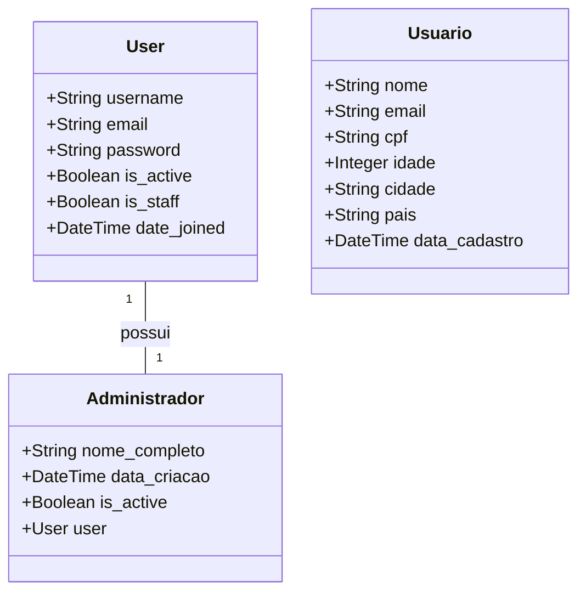

# CallmeSite - Sistema de Gerenciamento de chamados

## 📋 Índice
1. [Sobre o Projeto](#sobre-o-projeto)
2. [Diagrama de Classes](#diagrama-de-classes)
3. [Dicionário de Dados](#dicionário-de-dados)
4. [Endpoints da API](#endpoints-da-api)
5. [Configuração do Ambiente](#configuração-do-ambiente)
6. [Como Executar](#como-executar)

## 🎯 Sobre o Projeto
O CallmeSite é um sistema de gerenciamento de usuários desenvolvido em Django que permite o cadastro e administração de usuários, com uma interface administrativa personalizada.

## 📊 Diagrama de Classes



## 📚 Dicionário de Dados

### Tabela: Usuario
| Campo         | Tipo          | Descrição                           | Restrições                |
|--------------|---------------|-------------------------------------|---------------------------|
| id           | BigAutoField  | Identificador único                 | Chave primária           |
| nome         | CharField     | Nome do usuário                     | Máx. 100 caracteres      |
| email        | EmailField    | Email do usuário                    | Único                    |
| cpf          | CharField     | CPF do usuário                      | Único, Máx. 14 caracteres|
| idade        | IntegerField  | Idade do usuário                    | Número inteiro           |
| cidade       | CharField     | Cidade do usuário                   | Máx. 100 caracteres      |
| pais         | CharField     | País do usuário                     | Máx. 100 caracteres      |
| data_cadastro| DateTimeField | Data e hora do cadastro             | Auto preenchimento       |

### Tabela: Administrador
| Campo         | Tipo          | Descrição                           | Restrições                |
|--------------|---------------|-------------------------------------|---------------------------|
| id           | BigAutoField  | Identificador único                 | Chave primária           |
| user         | OneToOneField | Referência ao usuário Django        | Chave estrangeira        |
| nome_completo| CharField     | Nome completo do administrador      | Máx. 255 caracteres      |
| data_criacao | DateTimeField | Data e hora da criação              | Auto preenchimento       |
| is_active    | BooleanField  | Status de ativação                  | Padrão: True             |

## 🔌 Endpoints da API

### Endpoints Públicos

1. **Home**
   - URL: `/`
   - Método: GET
   - Descrição: Página inicial do sistema

2. **Registro de Usuário**
   - URL: `/registro/`
   - Métodos: GET, POST
   - Descrição: Permite o cadastro de novos usuários

### Endpoints Administrativos

1. **Login Administrativo**
   - URL: `/painel/login/`
   - Métodos: GET, POST
   - Descrição: Autenticação de administradores

2. **Registro de Administrador**
   - URL: `/painel/registro/`
   - Métodos: GET, POST
   - Descrição: Cadastro de novos administradores

3. **Dashboard Administrativo**
   - URL: `/painel/`
   - Método: GET
   - Descrição: Painel de controle para administradores
   - Requer: Autenticação

4. **Edição de Usuário**
   - URL: `/painel/usuario/<id>/editar/`
   - Métodos: GET, POST
   - Descrição: Edição de dados de usuários
   - Requer: Autenticação

5. **Deleção de Usuário**
   - URL: `/painel/usuario/<id>/deletar/`
   - Método: POST
   - Descrição: Remoção de usuários do sistema
   - Requer: Autenticação

6. **Logout**
   - URL: `/painel/logout/`
   - Método: GET
   - Descrição: Encerramento da sessão administrativa

## ⚙️ Configuração do Ambiente

### Pré-requisitos
- Python 3.8+
- Django 4.2+
- Banco de dados SQLite (padrão)

### Instalação
1. Clone o repositório
```bash
git clone [URL_DO_REPOSITORIO]
cd CallmeSite
```

2. Crie e ative um ambiente virtual
```bash
python -m venv .venv
source .venv/bin/activate  # Linux/Mac
.venv\Scripts\activate     # Windows
```

3. Instale as dependências
```bash
pip install -r requirements.txt
```

4. Execute as migrações
```bash
python manage.py migrate
```

5. Crie um superusuário
```bash
python manage.py createsuperuser
```

## 🚀 Como Executar

1. Ative o ambiente virtual
```bash
source .venv/bin/activate  # Linux/Mac
.venv\Scripts\activate     # Windows
```

2. Inicie o servidor de desenvolvimento
```bash
python manage.py runserver
```

3. Acesse o sistema em `http://localhost:8000`

## 🔐 Funcionalidades Principais

### Sistema de Usuários
- Cadastro de usuários com validação de dados
- Armazenamento seguro de informações pessoais
- Validação de CPF e email únicos

### Painel Administrativo
- Dashboard personalizado para gestão de usuários
- Sistema de autenticação seguro
- Gerenciamento completo de usuários (CRUD)
- Visualização de estatísticas e relatórios

### Segurança
- Autenticação obrigatória para acesso ao painel
- Proteção contra CSRF
- Validação de dados em formulários
- Senhas criptografadas 