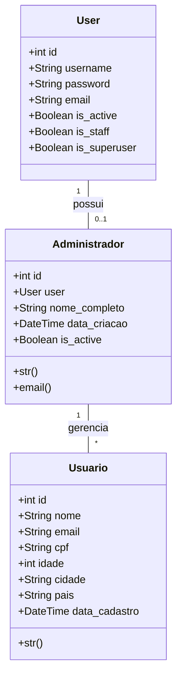

# CallMe - Plataforma de Serviços para Desenvolvedores

## Sobre o Projeto

CallMe é uma plataforma inspirada no modelo JetBrains, focada em fornecer serviços e ferramentas para desenvolvedores. O sistema oferece um catálogo de produtos e serviços com diferentes planos de assinatura, além de uma área administrativa robusta para gestão de usuários e serviços.

## Diagrama de Classes



## Dicionário de Dados

### Tabela: Usuario
| Campo         | Tipo          | Descrição                           | Restrições        |
|--------------|---------------|-------------------------------------|-------------------|
| id           | Integer       | Identificador único do usuário      | PK, Auto-increment|
| nome         | Varchar(100)  | Nome completo do usuário           | Not null         |
| email        | Varchar(254)  | Endereço de email                  | Unique, Not null |
| cpf          | Varchar(14)   | CPF do usuário                     | Unique, Not null |
| idade        | Integer       | Idade do usuário                    | Not null         |
| cidade       | Varchar(100)  | Cidade do usuário                  | Not null         |
| pais         | Varchar(100)  | País do usuário                    | Not null         |
| data_cadastro| DateTime      | Data e hora do cadastro            | Auto-now-add     |

### Tabela: Administrador
| Campo         | Tipo          | Descrição                           | Restrições        |
|--------------|---------------|-------------------------------------|-------------------|
| id           | Integer       | Identificador único do admin        | PK, Auto-increment|
| user         | Integer       | Referência ao User do Django        | FK, One-to-One   |
| nome_completo| Varchar(255)  | Nome completo do administrador     | Not null         |
| data_criacao | DateTime      | Data e hora da criação             | Auto-now-add     |
| is_active    | Boolean       | Status de ativação do admin        | Default=True     |

## Funcionalidades

### Área Pública
- Registro de novos usuários
- Visualização de produtos e serviços
- Página inicial com informações sobre a plataforma

### Área Administrativa
- Login/Logout de administradores
- Registro de novos administradores
- Dashboard com listagem de usuários
- Gerenciamento de usuários (edição/exclusão)
- Visualização de métricas e relatórios

## Tecnologias Utilizadas

- Python 3.9
- Django 4.2
- Bootstrap 5.3
- SQLite (desenvolvimento)
- HTML5/CSS3

## Instalação e Configuração

1. Clone o repositório:
```bash
git clone https://github.com/seu-usuario/CallmeSite.git
cd CallmeSite
```

2. Crie e ative um ambiente virtual:
```bash
python -m venv .venv
.venv\Scripts\activate  # Windows
source .venv/bin/activate  # Linux/Mac
```

3. Instale as dependências:
```bash
pip install -r requirements.txt
```

4. Execute as migrações:
```bash
python manage.py makemigrations
python manage.py migrate
```

5. Crie um superusuário:
```bash
python manage.py createsuperuser
```

6. Inicie o servidor:
```bash
python manage.py runserver
```

## Estrutura de URLs

- `/` - Página inicial
- `/registro/` - Registro de usuários
- `/painel/login/` - Login administrativo
- `/painel/registro/` - Registro de administradores
- `/painel/` - Dashboard administrativo
- `/painel/usuario/<id>/editar/` - Edição de usuário
- `/painel/usuario/<id>/deletar/` - Exclusão de usuário

## Contribuição

1. Faça um Fork do projeto
2. Crie uma branch para sua feature (`git checkout -b feature/AmazingFeature`)
3. Commit suas mudanças (`git commit -m 'Add some AmazingFeature'`)
4. Push para a branch (`git push origin feature/AmazingFeature`)
5. Abra um Pull Request

## Licença

Este projeto está sob a licença MIT. Veja o arquivo `LICENSE` para mais detalhes.

## Contato

Seu Nome - [@seutwitter](https://twitter.com/seutwitter) - email@exemplo.com

Link do Projeto: [https://github.com/seu-usuario/CallmeSite](https://github.com/seu-usuario/CallmeSite) 
