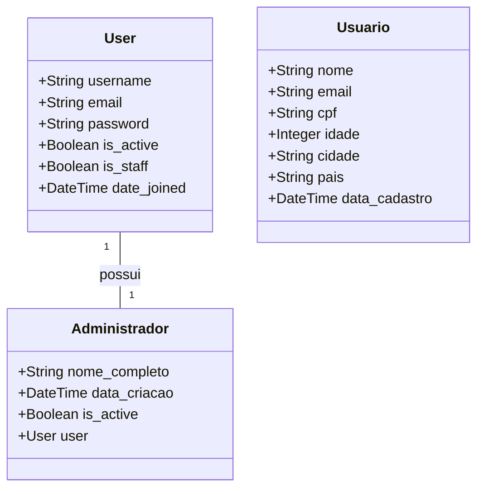

# 📞 CallMe — Plataforma de Vendas e Gerenciamento com Django

Bem-vindo ao **CallMe**, um sistema web completo construído com Django 5, que simula uma plataforma de vendas e também um sistema de gerenciamento de usuários e administradores, inspirado no estilo profissional do site da JetBrains.

---

## 🎯 Objetivo do Projeto

Desenvolver uma aplicação web funcional utilizando Django puro (sem frameworks JS externos), com foco em:

* Funcionalidade
* Segurança
* Usabilidade

---

## 🔑 Funcionalidades Principais

### Plataforma de Vendas:

* 🧑 Cadastro, login, logout e perfil de usuário
* 📦 CRUD de produtos (público e via admin)
* 💳 Integração com **Mercado Pago** (checkout)
* 📧 Envio de promoções por e-mail
* 🎨 Frontend responsivo com Bootstrap 5

### Sistema de Gerenciamento:

* Painel de administradores com login próprio
* Cadastro e administração de usuários
* Validação de dados e segurança (CSRF, senhas criptografadas)
* Dashboard administrativo com edição e deleção de usuários

---

## 🛠️ Tecnologias Utilizadas

| Tecnologia       | Finalidade                      |
| ---------------- | ------------------------------- |
| Django 5         | Framework backend e frontend    |
| SQLite           | Banco de dados padrão do Django |
| Bootstrap 5      | Estilização frontend            |
| Mercado Pago API | Pagamento e checkout            |
| SMTP / Gmail     | Envio de e-mails promocionais   |

---

## 📁 Estrutura do Projeto

```bash
callme/
├── config/          # Configurações do projeto
├── myapp/           # App principal (views, templates, static)
│   ├── templates/
│   ├── static/
├── manage.py
├── db.sqlite3
```

---

## 📸 Telas Planejadas

* Página inicial com produtos
* Tela de cadastro e login (com Bootstrap)
* Tela de checkout
* Área de perfil
* Página de confirmação de compra
* Painel de controle administrativo

---

## 🔒 Segurança

* Senhas protegidas por hash
* Proteção CSRF em todos os formulários
* Login protegido por sessão
* Autenticação obrigatória para painel admin

---

## 📚 Dicionário de Dados

### Tabela: Usuario

| Campo          | Tipo          | Descrição               | Restrições                |
| -------------- | ------------- | ----------------------- | ------------------------- |
| id             | BigAutoField  | Identificador único     | Chave primária            |
| nome           | CharField     | Nome do usuário         | Máx. 100 caracteres       |
| email          | EmailField    | Email do usuário        | Único                     |
| cpf            | CharField     | CPF do usuário          | Único, Máx. 14 caracteres |
| idade          | IntegerField  | Idade do usuário        | Inteiro                   |
| cidade         | CharField     | Cidade do usuário       | Máx. 100 caracteres       |
| pais           | CharField     | País do usuário         | Máx. 100 caracteres       |
| data\_cadastro | DateTimeField | Data e hora do cadastro | Auto preenchimento        |

### Tabela: Administrador

| Campo          | Tipo          | Descrição                      | Restrições          |
| -------------- | ------------- | ------------------------------ | ------------------- |
| id             | BigAutoField  | Identificador único            | Chave primária      |
| user           | OneToOneField | Referência ao usuário Django   | Chave estrangeira   |
| nome\_completo | CharField     | Nome completo do administrador | Máx. 255 caracteres |
| data\_criacao  | DateTimeField | Data e hora da criação         | Auto preenchimento  |
| is\_active     | BooleanField  | Status de ativação             | Padrão: True        |

---

## 🔌 Endpoints da API

### Públicos

1. **Home** - `GET /`
2. **Registro de Usuário** - `GET/POST /registro/`

### Administrativos

1. **Login Administrativo** - `GET/POST /painel/login/`
2. **Registro de Administrador** - `GET/POST /painel/registro/`
3. **Dashboard Administrativo** - `GET /painel/` (requer autenticação)
4. **Editar Usuário** - `GET/POST /painel/usuario/<id>/editar/`
5. **Deletar Usuário** - `POST /painel/usuario/<id>/deletar/`
6. **Logout** - `GET /painel/logout/`

---

## ⚙️ Configuração do Ambiente

### Pré-requisitos

* Python 3.8+
* Django 4.2+
* SQLite (padrão do Django)

### Instalação

```bash
git clone https://github.com/seu-usuario/callme.git
cd callme
python -m venv venv
# Ativação no Windows
dev\Scripts\activate
# Ou no Linux/Mac
source venv/bin/activate
pip install -r requirements.txt
python manage.py migrate
python manage.py createsuperuser
```

---

## 🚀 Como Executar

```bash
# Ativar ambiente virtual
source venv/bin/activate  # Linux/Mac
venv\Scripts\activate     # Windows

# Iniciar o servidor
python manage.py runserver
```

Acesse: `http://localhost:8000`

---

## 🧠 Diagrama de Classes



---

## 📬 Contato

Desenvolvido por \[Seu Nome]. Para dúvidas ou contribuições, entre em contato via \[[seu-email@email.com](mailto:seu-email@email.com)] ou crie uma issue no repositório.
